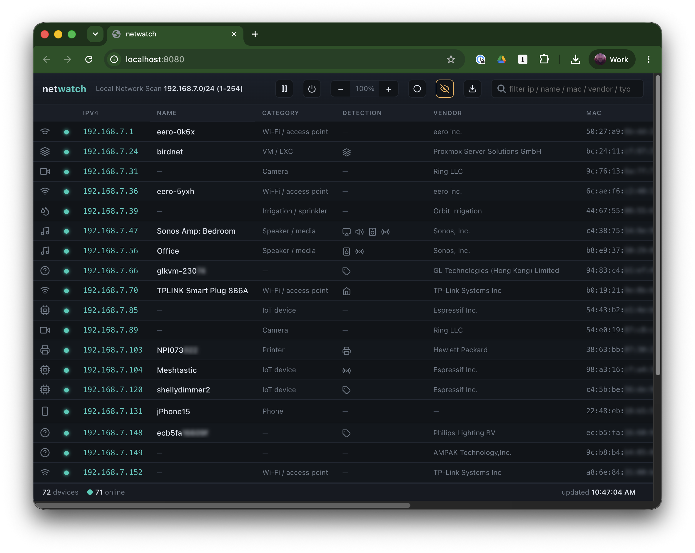
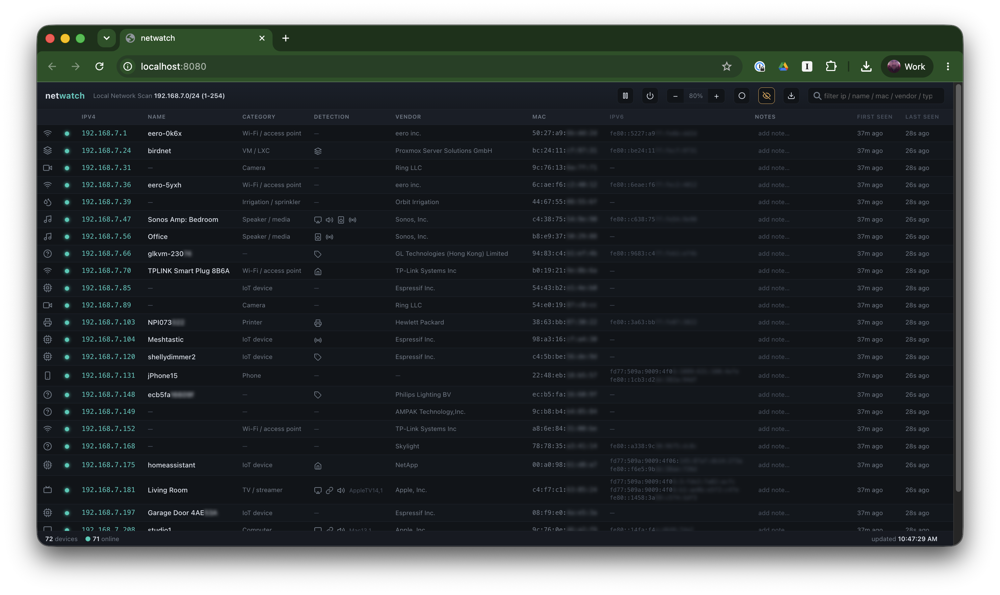

# netwatch

**Scan and watch your local network.** netwatch continuously discovers every
device on your subnet, enriches each one with vendor, hostname, and device-type
information, and serves a live inventory through a clean single-page web UI — no
agents, no cloud, no `sudo`.



## Features

- **Fast, agentless discovery.** Seeds from the kernel ARP/NDP neighbor tables
  first (dozens of hosts with MAC + vendor in milliseconds, zero packets), then
  uses an unprivileged ICMP ping sweep to provoke resolution and confirm
  liveness. Results stream into the UI progressively as each bucket completes.
- **Rich enrichment.** MAC vendor lookup from an embedded Wireshark `manuf` OUI
  database (handles /24, /28, /36 prefixes), reverse DNS, and mDNS / DNS-SD
  browsing for friendly names and Apple `model=` hints.
- **Device classification.** Hosts are sorted into categories (Wi-Fi, camera,
  speaker/media, printer, phone, tablet, TV, NAS, IoT, computer, …) from vendor
  and mDNS signals, each shown with an inline icon. A Detection column surfaces
  the protocols a host advertises over DNS-SD (AirPlay, Cast, HomeKit, Sonos,
  Spotify, printer, …) plus any reported hardware model.
- **Live web UI.** A sortable, filterable table with online/offline dots that
  reconciles in place — rows are keyed and only changed cells are patched, so
  scroll position, hover, and text selection survive each refresh. New hosts
  stream in progressively as the sweep runs.
- **Built-in tools, no front-end dependencies.** The UI is a single hand-written
  page — no CDN, no framework, no build step:
  - **Editable per-host notes**, persisted server-side and keyed to the MAC so
    they follow a device across IP changes.
  - **CSV export** of the current filtered/sorted view.
  - **Pause/resume** the scan and **stop the server** from the toolbar.
  - **Four-step light/dark theme**, **zoom**, and a **"fit" mode** that scales
    the table down so every column fits the window without horizontal scrolling.
  - **Privacy mode** blurs MACs, IPv6, and serial numbers for screenshots, and
    can hide hosts you tag `#private#`. (The screenshots above use it.)
  - **Double-click any cell** to copy its value.
- **Persistent history.** Hosts are stored in a local SQLite database, so
  first/last-seen survives restarts.
- **Cross-platform.** macOS/BSD read neighbor caches via `arp`/`ndp`; Linux via
  `ip neigh`.

### Fit mode

The default layout shows the core columns; the remaining ones (IPv6, notes,
first/last seen) sit off to the right. "Fit" mode scales the whole table down so
every column is visible at once:



## Running the server locally

### Prerequisites

- [Go](https://go.dev/dl/) 1.25 or newer

The ping sweep uses unprivileged ICMP sockets, so on macOS and Linux you can
run netwatch as your normal user — no `sudo` required.

### Run

From the repository root:

```bash
go run ./cmd/netwatch
```

Then open the UI at [http://localhost:9911](http://localhost:9911).

Alternatively, build a binary first:

```bash
go build -o netwatch ./cmd/netwatch
./netwatch
```

Press `Ctrl-C` to stop the server.

### Options

| Flag | Default | Description |
| --- | --- | --- |
| `-iface` | auto-detect | Network interface to scan |
| `-listen` | `:9911` | HTTP listen address |
| `-interval` | `30s` | Rescan interval |
| `-ping-timeout` | `2s` | Ping sweep reply window |
| `-mdns-wait` | `2s` | mDNS listen window |
| `-workers` | `128` | Concurrent ping senders |
| `-oui` | built-in | Path to an IEEE `oui.txt` or Wireshark `manuf` file for vendor lookups |
| `-db` | `netwatch.db` | Base SQLite database path for persistence (subnet is appended automatically; set empty to disable) |
| `-skip-ip` | none | IP address to exclude from results (repeatable or comma-separated) |
| `-skip-mac` | none | MAC address to exclude from results (repeatable or comma-separated) |

Discovered hosts are persisted to a SQLite file derived from `-db` (created on
first run) so first/last-seen history survives restarts. The scanned subnet is
appended to the filename so each network keeps its own inventory — e.g. with the
default `-db netwatch.db`, scanning `192.168.7.0/24` writes to
`netwatch-192.168.7.0_24.db`. This means changing networks never overwrites a
previous network's database.

Hosts matched by `-skip-ip` / `-skip-mac` are never pinged, enriched, or stored.

Example — scan a specific interface and serve on port 9000:

```bash
go run ./cmd/netwatch -iface en0 -listen :9000
```

Example — exclude a couple of hosts from results:

```bash
go run ./cmd/netwatch -skip-ip 192.168.7.60 -skip-mac b8:e9:37:50:29:88
go run ./cmd/netwatch -skip-ip 192.168.7.60,192.168.7.61
```

### HTTP endpoints

| Path | Description |
| --- | --- |
| `/` | Single-page web UI |
| `/api/hosts` | Host inventory as JSON (gzip-encoded when the client sends `Accept-Encoding: gzip`; add `?pretty=1` for indented output). Includes a `paused` flag for the scanner state |
| `/api/comment` | `POST {"key": "<host key>", "comment": "<text>"}` sets a host's note (keyed to MAC, so it survives IP changes); returns the updated host |
| `/api/scan` | `GET` returns `{"paused": bool}`; `POST ?action=pause\|resume\|toggle` changes the scanner state and returns the result |
| `/api/shutdown` | `POST` gracefully stops the server process (used by the UI's stop button) |
| `/healthz` | Liveness probe (`200 ok`) |

Discovery is cross-platform: macOS/BSD read the kernel caches via `arp`/`ndp`,
Linux via `ip neigh`.

### Security note

netwatch has no authentication and, by default, binds all interfaces (`:9911`),
exposing the full inventory to anyone who can reach the port. Treat it as a
trusted-LAN tool: bind it to loopback with `-listen 127.0.0.1:9911`, or put it
behind a reverse proxy / firewall if you need to reach it remotely.

### Tests

The unit tests are fully hermetic — they parse fixtures and use a temporary
SQLite database, so they never touch the live network:

```bash
go test ./... -race
```

They cover the pure, easy-to-break logic: OUI/vendor lookup (`/24`, `/28`,
`/36` prefixes), `arp`/`ndp` neighbor-table parsing (incomplete + group-MAC
filtering), device classification rules, the store's merge / IP→MAC re-key /
first-last-seen behavior, and SQLite persistence round-trip + prune.
